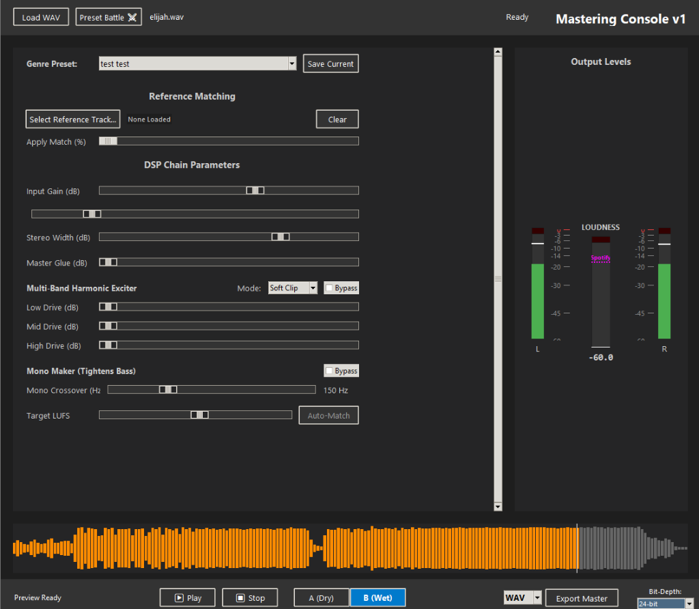
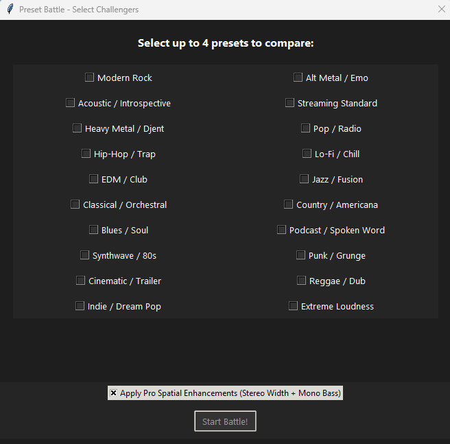
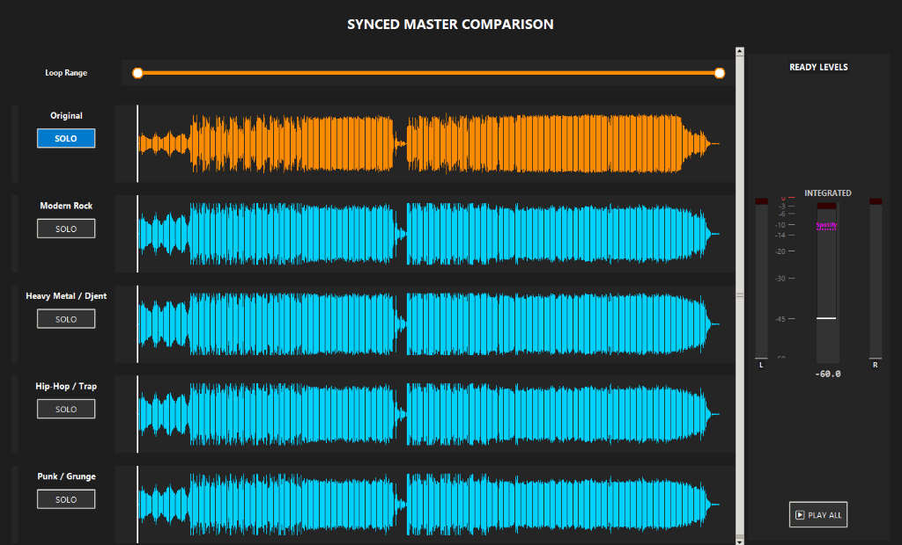

# 🎙️ High-Fidelity Mastering Console v2

A professional-grade, locally-hosted audio mastering environment designed to deliver loud, clear, and competitively balanced tracks. Optimized for modern music production with specific tools for 3D depth, harmonic richness, and reference-grade accuracy.

---

## 📸 Screenshots

> See the app in action — [View the full screenshots folder here](./screenshots/)

| Main Console | Preset Battle Selection | Synced Comparison |
|---|---|---|
| [](./screenshots/03_main_mastering_console.png) | [](./screenshots/01_preset_battle_selection.png) | [](./screenshots/02_synced_comparison_console.png) |

**What's shown:**
- **Main Mastering Console** — Full DSP chain: Input Gain, Air Shelf, Stereo Width, Multi-Band Harmonic Exciter, Mono Maker, and Target LUFS with Auto-Match. Real-time L/R and LUFS metering on the right.
- **Preset Battle Selection** — Pick up to 4 presets (from 20 genre-specific options) and hit *Start Battle!* to spin up fully mastered versions in the background.
- **Synced Comparison Console** — A/B/C/D compare up to 4 masters side-by-side with synced waveforms, real-time level meters, and a loop marker for focused listening.

---


## 🚀 Key Pro Features (The v2 Update)

### 1. **Intelligent Multi-Band Clipping**
Instead of a "one-size-fits-all" saturation, the **Intelligent Mode** uses three localized algorithms:
- **Hard Clipping (Low):** Instantaneous low-end peak truncation for drum punch without pumping.
- **Harmonic Shimmer (High):** Power-law excitation for high-frequency brilliance and detail.
- **Soft-Clip Warmth (Mid):** Smooth tanh saturation for vocal clarity and "analog" presence.

### 2. **Preset Battle ⚔️**
Stop guessing which "vibe" is best. Select up to 4 different mastering presets and run a **Batch Battle**. In just a few clicks, you get 4 different fully mastered versions that you can A/B test against each other in real-time.

**Battle Features:**
- **Instant Synced Soloing:** Flip between presets with zero latency. Hear the difference between "Radio Pop" and "Vinyl Warmth" instantly.
- **Real-Time Meter Bridge:** High-resolution L/R Peak and Integrated LUFS meters that swap instantly as you switch tracks.
- **Turbo-Bake Waveforms:** Powered by NumPy vectorization, generating high-res audio silhouettes in milliseconds.
- **Visual Loop Markers:** Precisely target the chorus or drop with visual highlighting and synced looping.
- **Efficiency Mode:** High-performance "Shadow Metering" runs off a downsampled buffer, keeping the UI silky smooth.
- **Cheeky Status Engine:** Stay entertained during the "Pro-Baking" phase with 30+ unique, witty engineering status updates.

### 3. **Asymmetric M/S Glue**
Built for 3D depth. This system splits the audio into Mid (center) and Side (edges):
- **Mid Channel:** High-ratio VCA compression to lock the kick and snare into a solid "spine."
- **Side Channel:** Low-ratio, slow-release compression to let the guitars and spatial effects breathe and expand.

### 4. **AI-Ready Matching EQ**
Match your tonal balance to your favorite professional song. Import any WAV/MP3 reference track, and the engine will:
- Mathematically analyze the target spectral signature.
- Generate a custom Linear Phase FIR filter.
- Apply the professional "curve" to your own track with a variable blend (0-100%).

### 5. **Interactive Full-Song Navigator**
The bottom of the UI features a "Full Song Visualizer." Click anywhere on the waveform silhouette to instantly seek to that point in the track. Perfect for fast navigation between the verse and the chorus.

---

## 🛠️ Core DSP Chain

- **64-bit Internal Precision:** Operates in `float64` for virtually infinite headroom.
- **True Peak Limiter:** 4x oversampling catches Inter-Sample Peaks to ensure compliance across all streaming platforms.
- **Standard-Compliant LUFS:** Built-in ITU-R BS.1770-4 metering targets exact export levels (e.g., -14 LUFS).
- **Zero-Latency A/B Switching:** Pre-cached buffers allow instant flipping between Dry and Wet signals without audio gaps.

---

## 🚦 Getting Started

### Prerequisites
- **Python 3.10+** (Recommend 12.x)
- FFmpeg (Required for MP3/FLAC support via `pydub`/`ffmpeg`)

### Installation
1. Clone the repository:
   ```bash
   git clone https://github.com/yourusername/MasteringApp.git
   cd MasteringApp
   ```
2. Install dependencies:
   ```bash
   pip install -r requirements.txt
   ```

### Execution
Simply run the diagnostic boot script:
```powershell
.\run.bat
```

---

## 📦 Built With
- **scipy / numpy:** High-performance signal processing.
- **pyloudnorm:** ITU-standard loudness measurements.
- **sounddevice:** Low-latency 32-bit float audio playback.
- **Pillow:** Dynamic UI icons and asset rendering.
- **librosa:** High-fidelity waveform analysis.

---

## 📜 License
Distributable under the **MIT License**. Use it for your home studio or your professional label.
